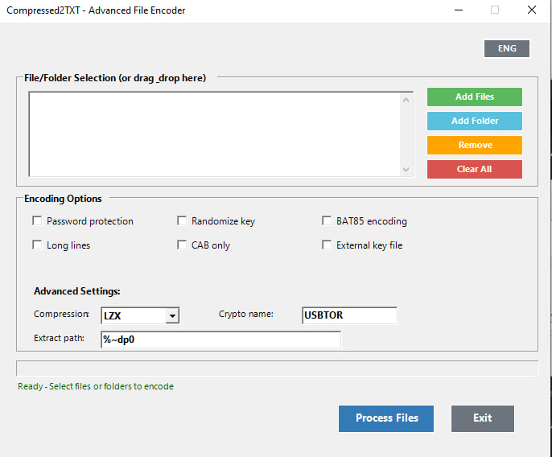
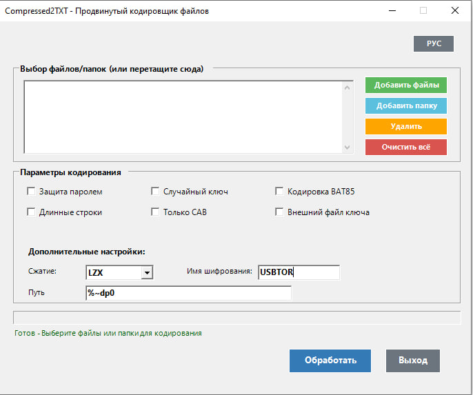

# Compressed2TXT GUI Mod
Windows 7 support ( PowerShell 2.0 / C# 2.0 )
Very fast encoding and decoding BAT85 and BAT91 classes
Multiple file(s) and folder(s) "Send to" menu selection 
Drag-and-drop support for files(s) and folders(s)  

**Forked from AveYo’s Compressed2TXT v6.5**

### Что улучшено:

-  **Drag-n-drop GUI** — теперь можно просто перетащить файлы/папки прямо в окно.
-  **Режим “архив + ключ”** — батник распакуется только если рядом с архивом лежит ключ-файл.
-  **Изменение криптоимени** — можно задать своё имя проекта (то, что в батнике идёт как `:bat2file:`).
   Плюс к этому добавил транслитерацию: если вводишь имя на русском, оно сразу преобразуется в латиницу, а пробелы заменяются.
-  **Выбор папки распаковки** — можно указать любой путь, по умолчанию рядом с батником/архивом.
-  **Поддержка MSzip** — альтернатива LZX.

>  Всё остальное работает, как в оригинале.

---

## Compressed2TXT GUI Mod

**Forked from AveYo’s Compressed2TXT v6.5**

### What's new:

-  **Drag-and-drop GUI** – just drop files or folders into the window to pack them.
-  **“Archive + key” mode** – the BAT unwraps only if the key file sits next to the archive.
-  **Custom crypto name** — set your own project name (the `:bat2file:` label inside the BAT).  
   Also added live transliteration: typing in Russian will auto-convert to Latin, spaces replaced too.
-  **Custom extraction folder** – choose where to unpack, not just the default next to the script/archive.
-  **MSzip compression option** – for when you prefer speed over ratio (or vice versa).

>  Everything else stays just like the original.
